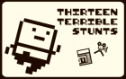
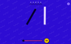
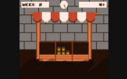
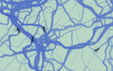
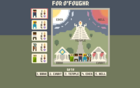
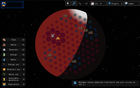
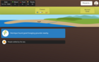
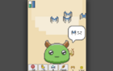

### Hi there 👋

Software developer for [Ecosia 🌳](https://ecosia.org/) and I made some games for fun.

📝 Find me [on dev.to](https://dev.to/mrlopis)

#### 🎮 js13k game entries

Every year since 2017 I've created a javascript mini game for the JS13K game jam.
I've also made a few other non-game-jam related ones.

